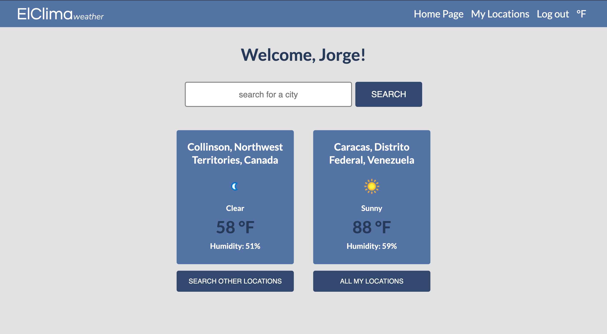
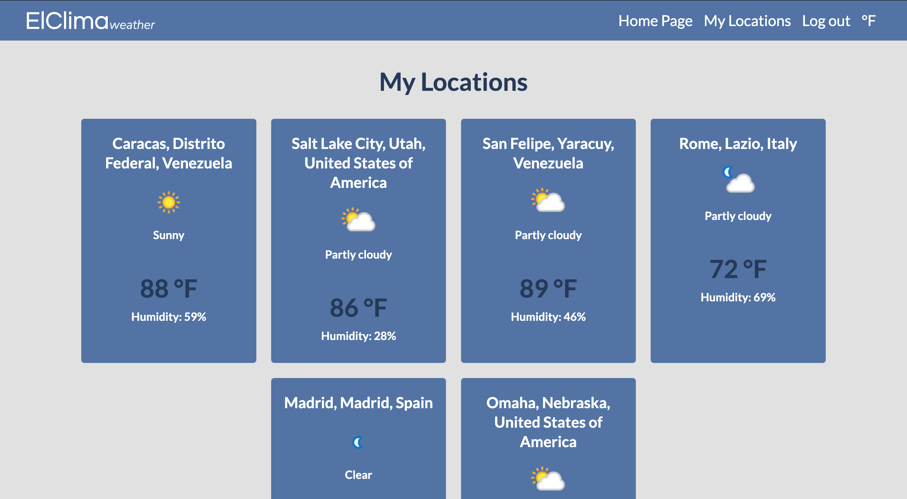
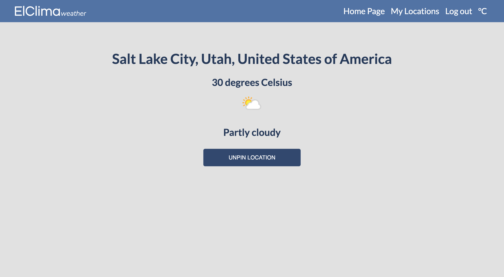
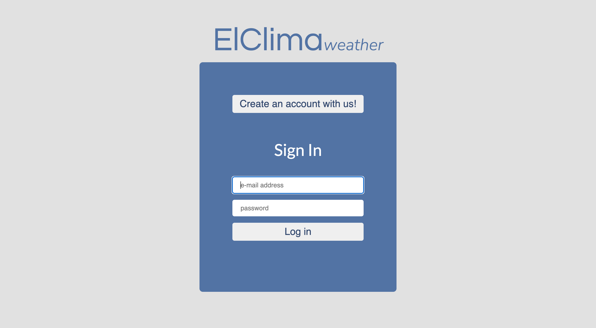
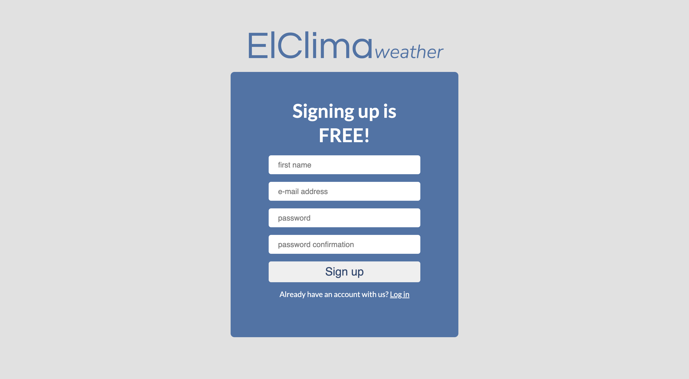
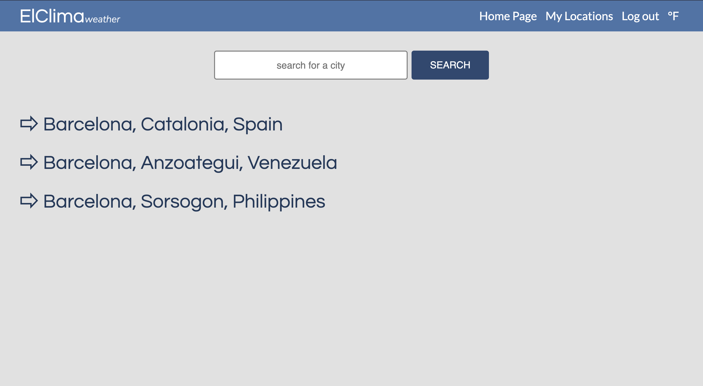

# ElClima Weather Web Application

<!-- ## Link to the website:  -->

This project is a basic MERN Stack weather application that allows a user to create an account and log in, as well as search for different locations in the entire world and their current weather forecast. The logged in user is able to pin (and unpin) any location they desire so it's saved in their personal locations directory and can access them more easily any time they need to check the current weather of such places.

## Technologies Used:

-JavaScript  
-Node JS  
-Express  
-Mongoose  
-MongoDB  
-React  
-CSS  
-WeatherAPI (https://www.weatherapi.com/)

## My experience building this project

This project was challenging to work on at times but that's what made it such a learning experience. There is definitely a lot of room for improvement and more learning when creating this type of applications where we work on its back-end, client side, as well as we implement a third-party API to it.

## Some of the biggest challenges were:

-Realizing that getting the data from the third-party API takes more time than what the computer does when running the application.  
-Debugging the response from the HTTP delete request.  
-Implementing the useEffect hook on React in an effective way.  
-Designing the architecture of the application on the React side.  
-Debugging issues with the HTTP Delete request in the back-end.

## Screenshots of the website:

